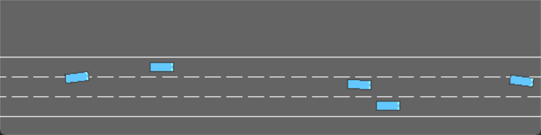

# ad-planner-playground

This project is a HighwayEnv-based driving simulation demo.



## Current Features

- EKF-based multi-step trajectory prediction for NPC vehicles using ground-truth observations.
- Frenet-based local trajectory generation with the current lane as the reference line.
- Visualization of predicted NPC trajectories and generated reference trajectories.

## Status

The planning and prediction components are implemented. The control component is still under testing and should not yet be considered stable.

## Run

Quick start:

```powershell
python demo.py
```

To open the Pygame viewer:

```powershell
python demo.py --human
```
