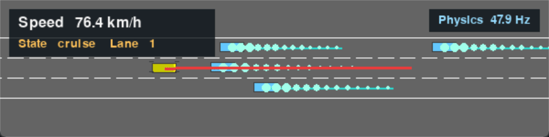

# ad-planner-playground

A modular autonomous-driving planning playground built on
[HighwayEnv](https://github.com/Farama-Foundation/HighwayEnv).



## Pipeline

The Ego vehicle is organized as a replaceable processing pipeline:

```text
GroundTruthDetector
    -> State Predictor
    -> Global Planner
    -> Local Planner
    -> Trajectory Controller
    -> HighwayEnv ContinuousAction
```

Planning code is separated by planning scope:

```text
planning/
├── planning_utils.py          # Shared polynomial, geometry, and sampling helpers
├── global_planning/
│   └── global_planner.py      # Lane-level route planning
└── local_planning/
    └── local_planner.py       # Frenet trajectory generation and validation
```

The package-level `planning` exports preserve the existing public imports, so
application code can continue to import planners from `planning` directly.

The current implementation includes:

- Ground-truth obstacle detection.
- EKF-based multi-step NPC trajectory prediction.
- A fixed-target-lane global planner.
- Time-parameterized Frenet candidate generation using quintic polynomials.
- Time-indexed collision checking using the full vehicle footprint.
- PID and Pure Pursuit trajectory controllers.
- An IDM/MOBIL fallback mode that bypasses the custom planning pipeline.
- Default and randomized NPC behavior policies.
- Visualization of EKF predictions, the selected trajectory, and all candidate
  trajectories.

## Installation

Create the Conda environment:

```powershell
conda env create -f environment.yml
conda activate highwayenv-py312
```

Alternatively, install the Python requirements directly:

```powershell
pip install -r requirements.txt
```

## Run

Run a headless simulation and save the final frame:

```powershell
python highway_main.py
```

Open the interactive Pygame viewer:

```powershell
python highway_main.py --human
```

In human mode, use the arrow keys to select the target lane:

```text
Up arrow    Move the target lane one lane upward
Down arrow  Move the target lane one lane downward
```

The target lane is clamped to the legal lanes of the current road segment.

In human mode, the Ego planning state can be changed at runtime:

```text
Z    Cruise state
X    Follow state
C    Stop state
```

Selecting a different target lane with an arrow key returns the Ego state to
`cruise` after the target lane is actually changed. Pressing an arrow at the
road boundary does not change the state.

## Configuration

Runtime configuration is split into two commented JSONC files:

- [`environment_config.jsonc`](environment_config.jsonc) contains only
  HighwayEnv parameters such as lane count, traffic count, and simulation
  frequencies.
- [`ego_config.jsonc`](ego_config.jsonc) contains the complete Ego pipeline
  configuration: Ego mode, state predictor, global planner, local planner, and
  all controller parameters. The EKF parameters are under
  `state_predictors.ekf`.

The default command loads both files automatically. Custom files can be passed
independently:

```powershell
python highway_main.py `
    --environment-config my_environment.jsonc `
    --ego-config my_ego.jsonc
```

Controller and state can be selected from the command line. The target speed
and initial target lane are configured only in `ego_config.jsonc`:

```text
local_planner.target_speed
global_planner.target_lane
```

Each Ego state can override its own local-planner and sampling parameters under
`local_planner.state_configs`. The state entries use the same parameter names
as the base local planner. Commonly customized values include
`target_speed` (km/h), `trajectory_duration`, `trajectory_dt`, and
`duration_samples`; `follow` can also override `follow_time_headway` and
`follow_min_gap`, while `stop` can override `stop_gap`.

For example:

```jsonc
"local_planner": {
  "target_speed": 100.0,
  "trajectory_dt": 0.2,
  "state_configs": {
    "cruise": {
      "target_speed": 100.0,
      "duration_samples": [1.5, 2.0, 2.5]
    },
    "follow": {
      "target_speed": 90.0,
      "trajectory_duration": 2.5,
      "trajectory_dt": 0.2,
      "duration_samples": [2.0, 2.5, 3.0],
      "follow_time_headway": 1.5,
      "follow_min_gap": 8.0
    },
    "stop": {
      "target_speed": 0.0,
      "trajectory_duration": 2.5,
      "trajectory_dt": 0.2,
      "duration_samples": [2.0, 2.5, 3.0],
      "stop_gap": 5.0
    }
  }
}
```

For example:

```powershell
python highway_main.py --human `
    --ego-controller pure_pursuit `
    --draw-all-trajectories
```

The EKF configuration uses diagonal covariance and noise vectors:

```jsonc
"state_predictors": {
  "ekf": {
    "initial_covariance": [2.0, 2.0, 4.0, 0.2, 0.5],
    "process_noise": [0.2, 0.2, 1.0, 0.02, 0.1],
    "measurement_noise": [0.5, 0.5, 1.0, 0.05]
  }
}
```

The EKF state vector is `[x, y, speed, heading, yaw_rate]`; the observation
vector is `[x, y, speed, heading]`.

## Modes

Available Ego controllers:

```text
idm, pid, pure_pursuit
```

Available explicit planning states:

```text
cruise, follow, stop
```
